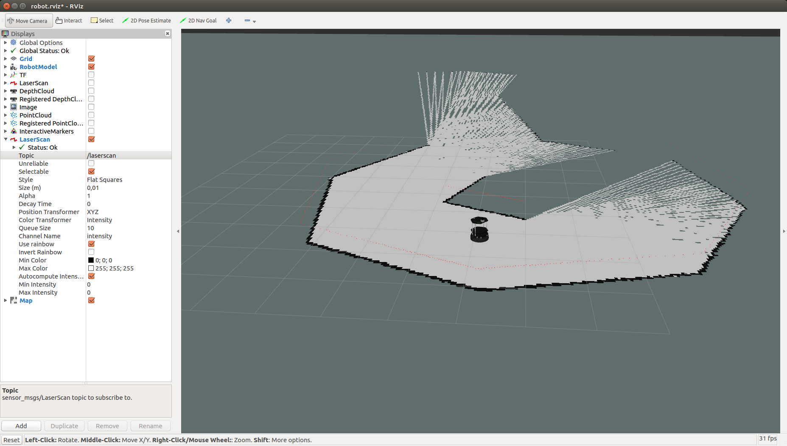
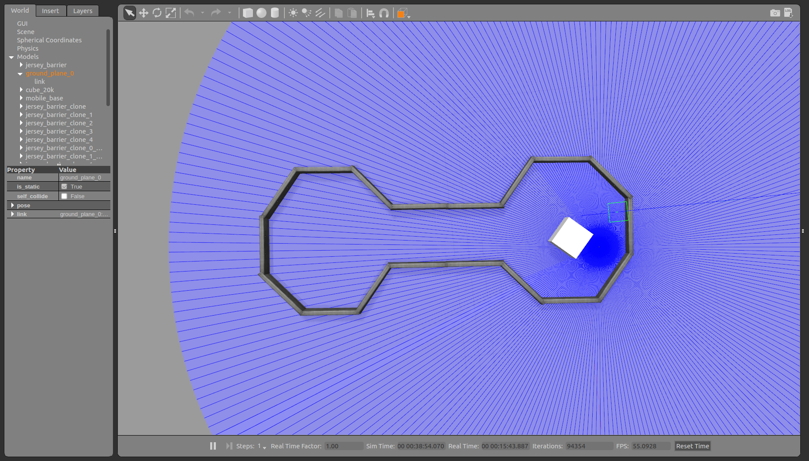

# autonomous-turtlebot
This project contains a base for simulating the workspace and workflow of turtlebot mobile platform for navigating tasks.
The simulated robot is equipped with Hokuyo laser scanner which can be fully customized. The robot uses Hector SLAM for building 2D representation of an environment. The robot can be controlled either manually or automatically using standard move_base planner.

## How to start

In order to run this application you must follow these steps:

* Build the whole workspace by executing **catkin_make** command
* Run **source devel/setup.bash** command
* Run **roslaunch turtlebot_gazebo turtlebot_world.launch**

If you want to get an occupancy map built by Hector Slam you should do the following:
* Run **apt-get install ros-kinetic-hector-slam** 
* Run **roslaunch turtlebot_gazebo scanmatcher.launch**
* Run **roslaunch turtlebot_gazebo hector_mapping.launch**

